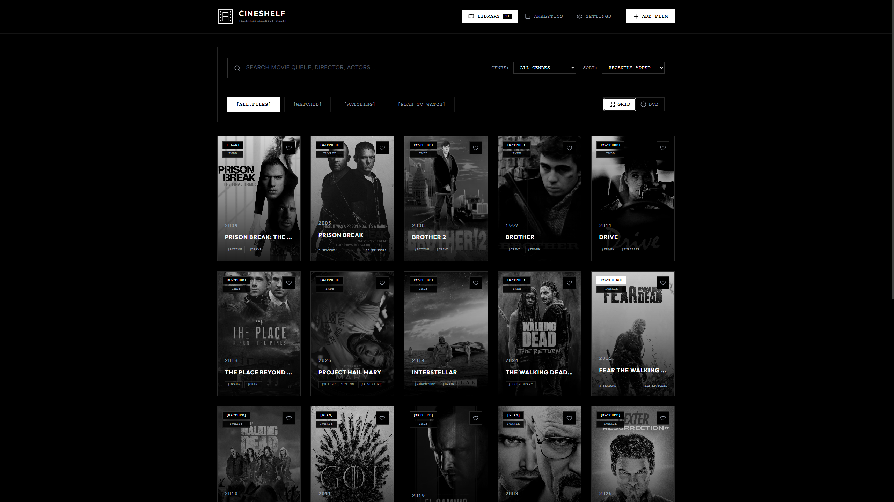
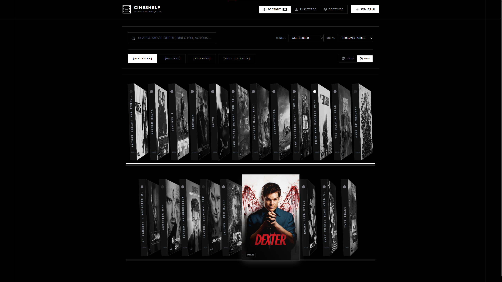

# Кинополка

## **CineShelf: Ваша персональная кинотека с душой**

**CineShelf** — это современное веб-приложение для коллекционеров и любителей кино, превращающее процесс отслеживания фильмов и сериалов в визуальное удовольствие. Мы объединили функциональность трекера с эстетикой физической коллекции.

### **Почему CineShelf?**

Забудьте о скучных таблицах. CineShelf предлагает уникальный интерфейс в стиле **виртуальной DVD-полки**. Благодаря 3D-анимациям раскрытия кейсов, вы почувствуете тот самый уют, который дарит владение физической библиотекой, но со всеми преимуществами цифровых технологий.

### **Ключевые возможности:**

- **Виртуальная полка:** Переключайтесь между классическим сеточным видом и иммерсивной 3D-полкой с плавной анимацией.
- **Полный контроль над сериалами:** Интеграция с TVMaze позволяет автоматически подтягивать сезоны и серии. Следите за прогрессом просмотра и ставьте оценки каждому эпизоду отдельно.
- **Ваши заметки и рейтинги:** Храните личные рецензии, пометки, даты просмотров и оценки по 10-балльной шкале.
- **Умная организация:** Используйте теги, статусы (смотрел/смотрю/планирую) и быстрый поиск по всей базе.
- **Работа без границ:** Приложение полностью локально — все ваши данные хранятся в браузере. Вы можете пользоваться им даже без интернета (после загрузки метаданных).
- **Двуязычный интерфейс:** Полная поддержка русского и английского языков.

### **Для кого это приложение?**

- **Киноманам:** для тех, кто хочет красиво структурировать свой «кино-багаж».
- **Сериальным марафонцам:** для тех, кому важен детальный трекинг каждого эпизода.
- **Эстетам:** для тех, кто ценит качественный UI, плавные анимации и Dark Mode.

### **Технологический стек**

CineShelf — это легковесное и быстрое React-приложение на TypeScript, созданное с вниманием к деталям. Мы используем современный CSS без тяжелых фреймворков, чтобы обеспечить высокую производительность и плавность 3D-эффектов.
